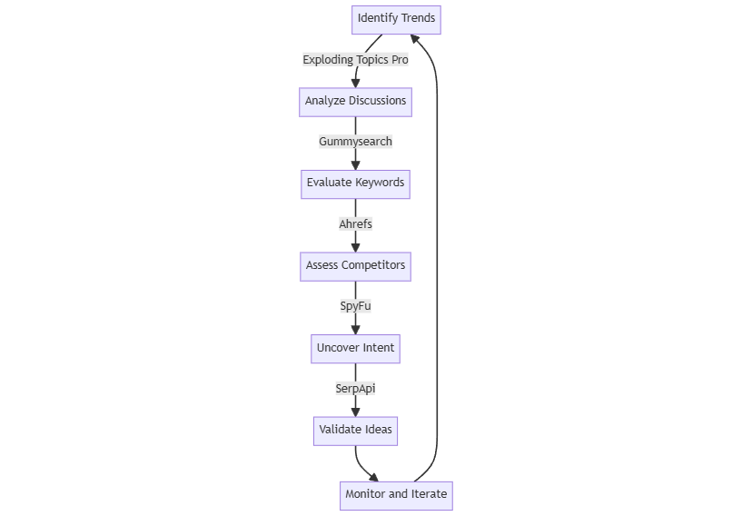

# 📑 Audience Research and Idea Validation

This toolset identifies market opportunities, validates business ideas, and reveals target audience needs. The integrated workflow informs product development and marketing strategies.

<figure><figcaption>
End-to-end workflow
</figcaption></figure>

### Process

1. **Identify Trends -** [**Exploding Topics Pro**](https://explodingtopics.com) **Action:** Detect rising topics and market opportunities.
2. **Analyze Discussions -** [**Gummysearch** ](https://gummysearch.com)**Action:** Find trending subreddits. Extract pain points and user sentiments.
3. **Evaluate Keywords -** [**Ahrefs** ](https://ahrefs.com)**Action:** Find high-volume, low-competition keywords within trends.
4. **Assess Competitors -** [**SpyFu** ](https://www.spyfu.com)**Action:** Identify competitors' profitable keywords and content gaps.
5. **Uncover Intent -** [**SerpApi** ](https://serpapi.com)**Action:** Analyze "People Also Ask" results. Reveal user questions and needs.
6. **Validate Ideas Action:** Combine tool insights to prioritize features, develop content, and identify unique selling points.
7. **Monitor and Iterate Action:** Set regular monitoring schedules. Refine strategies based on market changes.

**Outcome:** Reduce product launch risks, identify niche opportunities, develop targeted marketing, and maintain competitive edge.
