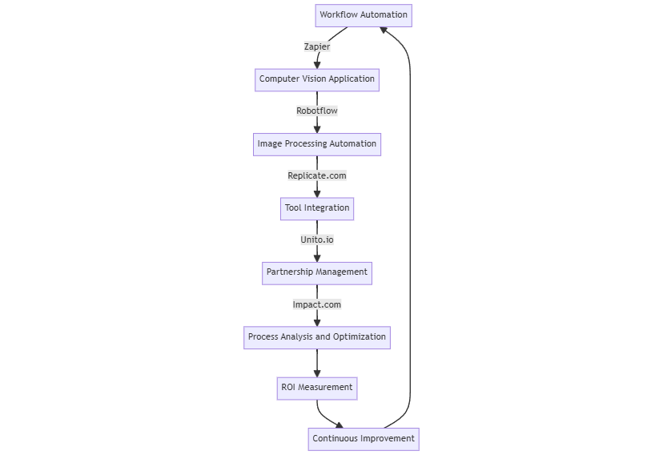

# Automation and Efficiency

This toolset focuses on automating repetitive tasks, optimizing workflows, and enhancing overall business efficiency.

<figure><figcaption></figcaption></figure>

### Process

1. **Workflow Automation -** [**Zapier** ](https://zapier.com)**Action:** Create automated workflows connecting various apps and services.
2. **Computer Vision Application -** [**Robotflow** ](https://roboflow.com)**Action:** Build and deploy computer vision apps for tasks like quality control or inventory management.
3. **Image Processing Automation -** [**Replicate.com**](https://replicate.com) **Action:** Implement AI image editing tools for e-commerce product photos or marketing visuals.
4. **Tool Integration Tool -** [**Unito.io**](https://unito.io) **Action:** Seamlessly integrate different tools and platforms to create a unified workflow.
5. **Partnership Management -**[ **Impact.com**](https://impact.com)**'s Partnership Cloud Action:** Automate and optimize partner and affiliate management processes.
6. **Process Analysis and Optimization Action:** Regularly review automated processes for bottlenecks and optimization opportunities.
7. **ROI Measurement Action:** Track time and resources saved through automation. Calculate ROI for each automated process.
8. **Continuous Improvement Action:** Stay updated on new automation technologies and implement as appropriate.

**Outcome:** Reduced manual workload, increased operational efficiency, improved accuracy in repetitive tasks.
