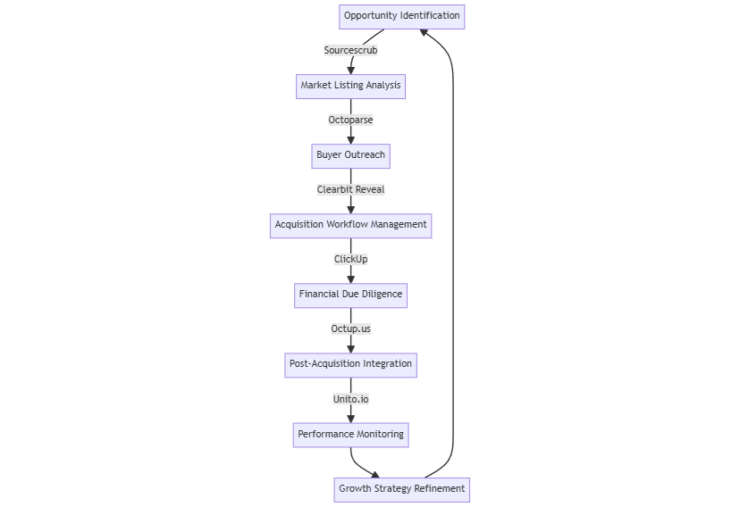

# 📈 Business Acquisition and Growth

This toolset aids in identifying, evaluating, and acquiring businesses, as well as optimizing post-acquisition growth strategies.

<figure><figcaption></figcaption></figure>

### Process

1. **Opportunity Identification -** [**Sourcescrub** ](https://www.sourcescrub.com)**Action:** Identify promising businesses not yet on the market for potential acquisition.
2. **Market Listing Analysis -** [**Octoparse** ](https://www.octoparse.com)**Action:** Scrape and analyze Acquire.com listings for potential acquisition targets.
3. **Buyer Outreach -** [**Clearbit** ](https://clearbit.com)**Reveal Action:** Identify and reach out to potential acquirers or sellers visiting your acquisition website.
4. **Acquisition Workflow Management - ClickUp Action:** Create and manage the entire acquisition workflow from initial contact to deal closure.
5. **Financial Due Diligence -** [**Octup.us** ](https://octup.com)**Action:** Conduct AI-driven financial forensics to uncover hidden value in target companies.
6. **Post-Acquisition Integration -** [**Unito.io**](https://unito.io) **Action:** Seamlessly integrate tools and processes post-acquisition to reduce friction.
7. **Performance Monitoring Action:** Track key performance indicators of acquired businesses and integration progress.
8. **Growth Strategy Refinement Action:** Continuously refine growth strategies based on performance data and market changes.

**Outcome:** Streamlined acquisition process, improved target selection, enhanced post-acquisition value creation.
