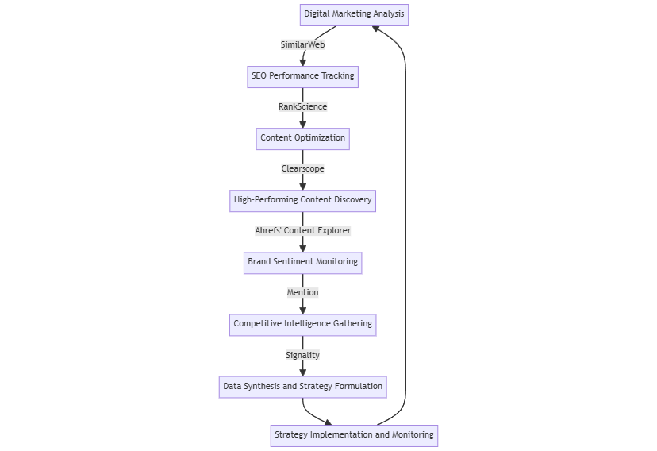

# 🧠 Competitive Analysis and Market Intelligence

This toolset helps businesses understand their competitive landscape, identify market trends, and optimize their strategies for better market positioning.

<figure><figcaption></figcaption></figure>

### Process

1. **Digital Marketing Analysis -** [**SimilarWeb** ](https://www.similarweb.com)**Action:** Analyze competitors' digital marketing strategies and website traffic sources.
2. **SEO Performance Tracking -** [**RankScience** ](https://www.rankscience.com)**Action:** Conduct automated A/B testing of SEO changes to improve search rankings.
3. **Content Optimization -** [**Clearscope** ](https://www.clearscope.io/?)**Action:** Optimize content immediately for better search engine performance and relevance.
4. **High-Performing Content Discovery - Ahrefs' Content Explorer Action**: Identify top-performing content in your industry to guide content strategy.
5. **Brand Sentiment Monitoring -** [**Mention** ](https://mention.com/en/)**Action:** Track brand sentiment and identify potential business opportunities or threats.
6. **Competitive Intelligence Gathering -** [**Signality** ](https://www.signality.com)**Action:** Gather AI-driven competitive intelligence to inform strategic decisions.
7. **Data Synthesis and Strategy Formulation Action:** Combine insights from all tools to formulate comprehensive market strategies.
8. **Strategy Implementation and Monitoring Action:** Implement strategic changes and continuously monitor their impact on market position.

**Outcome:** Improved market positioning, data-driven decision making, ability to quickly adapt to market changes.
