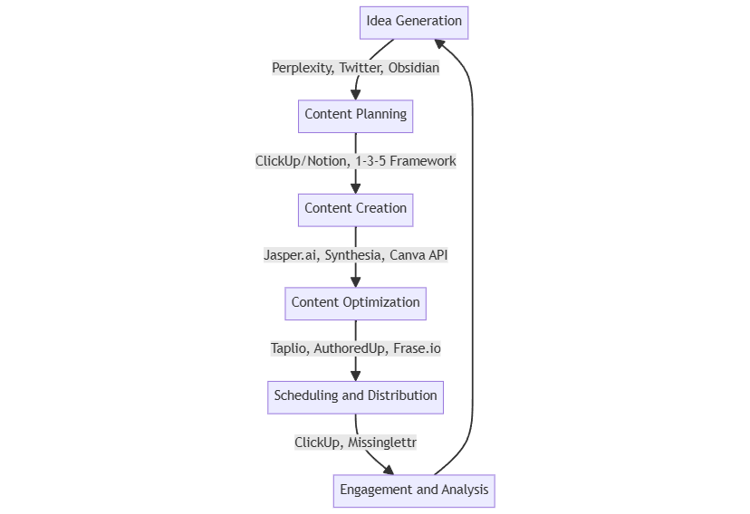

# ✍️ Content Creation and Optimization

This toolset streamlines content creation, enhances quality, and optimizes for engagement across multiple platforms. The workflow integrates various content types for comprehensive marketing campaigns.


**Note:** We go in-depth into our content creation system in [this issue of the newsletter](https://newsletter.ertiqah.com/p/weeks-worth-content-just-2-hours). Below is a more expanded version of the system that we're currently using, as of August 2024.


<figure><figcaption>
End-to-End Workflow
</figcaption></figure>

### Process

1. **Idea Generation Tools:** [Perplexity Chrome Extension](https://chromewebstore.google.com/detail/perplexity-ai-companion/hlgbcneanomplepojfcnclggenpcoldo?hl=en), Twitter, [Obsidian](https://obsidian.md) Action:
   * Use Perplexity to summarize interesting articles while browsing.
   * Curate Twitter lists of thought leaders in your field.
   * Store summaries and ideas in Obsidian, organized by topic.
   * Use AI (e.g., [Claude](https://claude.ai)) to generate more content ideas based on curated information.
2. **Content Planning -** [**ClickUp** ](https://clickup.com)**or** [**Notion** ](https://www.notion.so)**Action:** Implement the 1-3-5 Framework:
   * Create one pillar content piece (e.g., newsletter)
   * Extract three core ideas from the pillar content
   * For each core idea, create five micro-content pieces:
     * Two short, written posts
     * One short-form video (60 seconds or less)
     * One carousel post (5-10 slides)
     * One poll or question post
3. **Content Creation -** [**Jasper.ai**](https://www.jasper.ai)**,** [**Enji.co**](https://www.enji.co)**,** [**Synthesia**](https://www.synthesia.io)**,** [**Canva API**](https://www.canva.com/developers/) **Action:**
   * Use Jasper.ai for written content
   * Create video content with Synthesia
   * Generate visual assets using Canva API
4. **Content Optimization -** [**Taplio**](https://taplio.com/?)**,** [**AuthoredUp**](https://authoredup.com/?red=ertiqae67be1)**,** [**Frase.io**](https://www.frase.io) **Action:**
   * Optimize LinkedIn content with Taplio
   * Enhance posts with advanced formatting using AuthoredUp
   * Create AI-powered content briefs with Frase.io
5. **Scheduling and Distribution - ClickUp,** [**Missinglettr** ](https://missinglettr.com)**Action:**
   * Schedule content for optimal posting times in ClickUp
   * Use Missinglettr for AI-driven social media post generation
6. **Engagement and Analysis Action:**
   * Engage with audience 30 minutes before and after posting
   * Monitor content performance and adjust strategy based on metrics

**Outcome:** Consistent content production across multiple platforms, improved engagement, efficient resource use.
