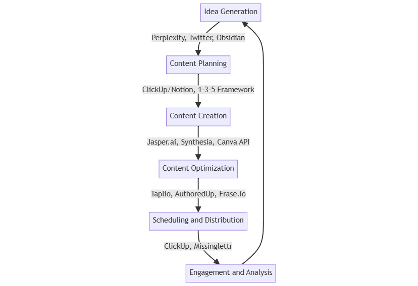

# ✍️ Content Creation and Optimization

This toolset streamlines content creation, enhances quality, and optimizes for engagement across multiple platforms. The workflow integrates various content types for comprehensive marketing campaigns.


**Note:** We go in-depth into our content creation system in [this issue of the newsletter](https://newsletter.ertiqah.com/p/weeks-worth-content-just-2-hours). Below is a more expanded version of the system that we're currently using, as of August 2024.


<figure><figcaption>
End-to-End Workflow
</figcaption></figure>

### Process

### 1. **Idea Generation Tools**

**Tools:** Perplexity Chrome Extension, Twitter, Obsidian, [LiGo Theme-based Ideas](https://ligo.ertiqah.com/features/content-themes)

**Action:**

* Use Perplexity to summarize interesting articles while browsing
* Curate Twitter lists of thought leaders in your field
* Store summaries and ideas in Obsidian, organized by topic
* Use AI (e.g., Claude) to generate more content ideas based on curated information

### 2. **Content Planning with Content Themes**

**Tools:** ClickUp or Notion + [LiGo's Content Theme System](https://ligo.ertiqah.com/)

**Action:**

* Create client-specific content themes in LiGo that define:
  * Client background and offering
  * Target audience
  * Key topics and expertise areas
  * Preferred tone and style
* Implement the 1-3-5 Framework:
  * Create one pillar content piece (e.g., newsletter)
  * Extract three core ideas from the pillar content
  * For each core idea, generate five micro-content pieces using LiGo

### 3. **Content Generation**

**Tools:** [LiGo](https://ligo.ertiqah.com/), Synthesia, Canva API, [AudioAI](https://chromewebstore.google.com/detail/audio-ai-voice-to-text-fo/phdhgapeklfogkncjpcpfmhphbggmdpe)

**Action:**

* Use LiGo to generate LinkedIn-specific content:
  * Two text-based posts from each content idea
  * One carousel outline (5-10 slides)
  * One poll or question post
* Use AudioAI to dictate content briefs and additional insights
* Create video content with Synthesia based on LiGo-generated scripts
* Generate visual assets using Canva API to complement your posts

### 4. **Content Optimization**

**Tools:** [LiGo](https://ligo.ertiqah.com/tools/linkedin-post-rewriter) + [LiGo Chrome Extension](https://chromewebstore.google.com/detail/ligo-for-linkedin/dlclgkldbjggemolgmajabobdcofgjof), Frase.io

**Action:**

* Optimize LinkedIn content directly in LiGo with:
  * Multiple post variants (choose from 6 different styles)
  * AI-powered personalization based on your voice
  * Hook optimization for higher engagement
* Use the LiGo Chrome Extension to enhance your content while browsing LinkedIn
* Transform existing client content using LiGo's [LinkedIn Post Rewriter](https://ligo.ertiqah.com/tools/linkedin-post-rewriter)
* Create AI-powered content briefs with Frase.io for longer-form content

### 5. **Scheduling and Analytics**

**Tools:** [LiGo Analytics](https://ligo.ertiqah.com/blog/how-to-use-ligo-analytics-to-refine-your-linkedin-strategy), ClickUp, Missinglettr

**Action:**

* Use LiGo Analytics to determine optimal posting times based on client-specific audience data
* Schedule content directly from LiGo or export to your broader marketing calendar
* Analyze day-of-week and time-of-day performance patterns for each client
* Use Missinglettr for additional distribution channels beyond LinkedIn

### 6. **Engagement and Growth**

**Tools:** [LiGo Chrome Extension](https://chromewebstore.google.com/detail/ligo-for-linkedin/dlclgkldbjggemolgmajabobdcofgjof), LiGo Analytics

**Action:**

* Use LiGo Chrome Extension to generate thoughtful comments on industry posts
* Engage with audience 30 minutes before and after posting
* Monitor content performance using LiGo Analytics to:
  * Identify which content themes drive the most engagement
  * Track growth in reactions, comments, and connections
  * Generate AI-powered insights on content strategy improvements

### 7. **Client Reporting**

**Tools:** LiGo Analytics, Google Data Studio

**Action:**

* Export LiGo Analytics data to create client-ready reports
* Demonstrate clear ROI with engagement metrics
* Showcase growth trends and content performance
* Provide AI-generated insights and recommendations for strategy adjustments

***

#### Pro Tip for Agency Owners

For maximum efficiency when managing multiple clients, use [LiGo's theme-based system](https://ligo.ertiqah.com/blog/creating-your-linkedin-content-theme-the-strategic-foundation-for-consistent-growth) to create distinct content strategies for each client. This approach ensures consistent voice and messaging while saving significant time in the content creation process.

With this system, most agencies report reducing their LinkedIn content production time by 70% while improving engagement metrics through data-driven posting strategies and AI-optimized content.

**Outcome:** Consistent content production across multiple platforms, improved engagement, efficient resource use.
