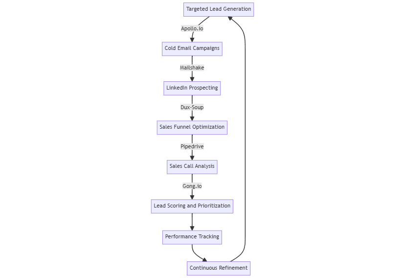

# 🏋️ Lead Generation and Sales Optimization

This toolset focuses on identifying potential customers, optimizing outreach, and improving sales processes to increase conversion rates and revenue.

<figure><figcaption></figcaption></figure>

### Process

1. **Targeted Lead Generation -** [**Apollo.io**](https://www.apollo.io) **Action:** Set up automated lead generation and email sequences for specific target audiences.
2. **Cold Email Campaigns -** [**Mailshake** ](https://mailshake.com)**Action:** Create and A/B test cold email campaigns to improve open and response rates.
3. **LinkedIn Prospecting -** [**Dux-Soup**](https://www.dux-soup.com) **Action:** Automate LinkedIn prospecting to identify and connect with potential leads.
4. **Sales Funnel Optimization -** [**Pipedrive** ](https://www.pipedrive.com)**Action:** Implement AI sales coach to optimize acquisition funnel and improve conversion rates.
5. **Sales Call Analysis -** [**Gong.io**](https://www.gong.io) **Action:** Analyze pitch calls to identify successful patterns and areas for improvement.
6. **Lead Scoring and Prioritization Action:** Use data from all tools to score leads and prioritize high-potential prospects.
7. **Performance Tracking Action:** Monitor key sales metrics (conversion rates, average deal size, sales cycle length).
8. **Continuous Refinement Action:** Regularly update lead generation strategies and sales processes based on performance data.

**Outcome:** Increased lead quality, improved conversion rates, shortened sales cycles, more efficient use of sales resources.
