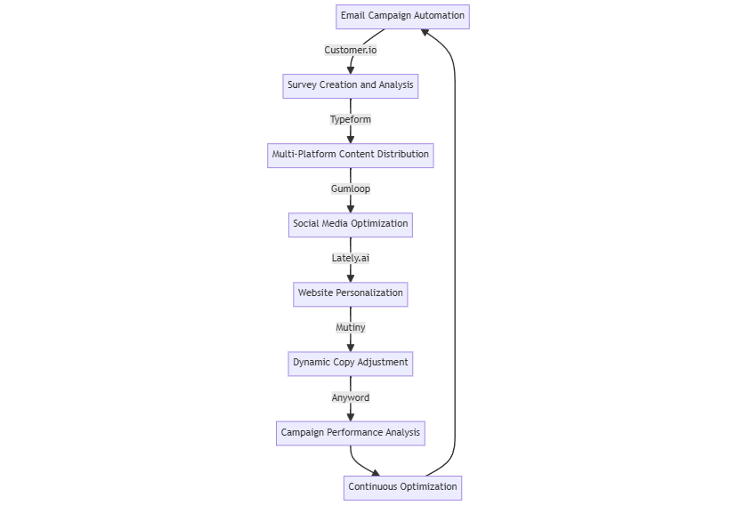

# 📡 Marketing Automation and Personalization

This toolset enhances marketing efficiency through automation and personalization, improving customer engagement and conversion rates.

<figure><figcaption></figcaption></figure>

### Process

1. **Email Campaign Automation -** [**Customer.io** ](https://customer.io)**Action:** Set up AI-powered referral email campaigns.
2. **Survey Creation and Analysis -** [**Typeform** ](https://www.typeform.com)**Action:** Create and analyze AI-driven referral surveys for customer feedback.
3. **Multi-Platform Content Distribution -** [**Gumloop** ](https://www.gumloop.com)**Action:** Automatically distribute content across various platforms.
4. **Social Media Optimization -** [**Lately.ai** ](https://www.lately.ai)**Action:** Optimize social media content using AI-driven insights.
5. **Website Personalization -** [**Mutiny** ](https://www.mutinyhq.com)**Action:** Implement rapid personalization and conversion rate optimization (CRO) for websites.
6. **Dynamic Copy Adjustment -** [**Anyword** ](https://anyword.com/?)**Action:** Dynamically personalize website copy based on visitor behavior.
7. **Campaign Performance Analysis Action:** Monitor key metrics across all platforms. Adjust strategies based on performance data.
8. **Continuous Optimization Action:** Regularly update automation rules and personalization algorithms based on collected data and emerging trends.

**Outcome:** Improved customer engagement, higher conversion rates, consistent brand messaging across platforms, efficient use of marketing resources.
