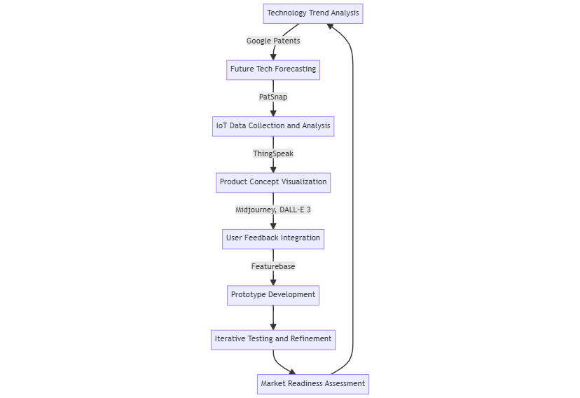

# ⚒️ Product Development and Innovation

This toolset enables businesses to develop innovative products, improve existing offerings, and stay ahead of market trends through data-driven insights and advanced technologies.

<figure><figcaption></figcaption></figure>

### Process

1. **Technology Trend Analysis -** [**Google Patents** ](https://patents.google.com)**Action:** Scrape recent patent filings in emerging technologies to identify industry trends.
2. **Future Tech Forecasting -** [**PatSnap**](https://www.patsnap.com) **Action:** Use AI to forecast technology trends and potential market disruptions.
3. **IoT Data Collection and Analysis -** [**ThingSpeak** ](https://thingspeak.com)**Action:** Collect and analyze data from IoT sensors for product improvement or new product ideas.
4. **Product Concept Visualization -** [**Midjourney** ](https://www.imagine.art)**and** [**DALL-E 3**](https://openart.ai/home?gad\_source=1\&gclid=Cj0KCQjwwuG1BhCnARIsAFWBUC3fS2q7f\_1hxmX9qS3aRW8wUOPThuFaQOImx7o3cDlA4RF5RaJUAXoaAt1wEALw\_wcB) **Action:** Create visual representations of product concepts for internal review or customer feedback.
5. **User Feedback Integration -** [**Featurebase** ](https://www.featurebase.app)**Action:** Crowdsource product ideas and feature requests from your user base.
6. **Prototype Development Action:** Use insights from all tools to develop initial product prototypes.
7. **Iterative Testing and Refinement Action:** Conduct user testing of prototypes and iterate based on feedback.
8. **Market Readiness Assessment Action:** Evaluate product-market fit using collected data before full-scale launch.

**Outcome:** Accelerated product development cycles, improved product-market fit, increased innovation capacity.
